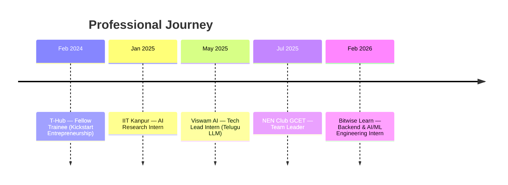

<div align="center">


<a href="https://nikhileshraju.me">

</a>

<br/>

[](https://nikhileshraju.me)
[](https://linkedin.com/in/nikhilesh-raju-kuppili-76537927a/)
[](mailto:nikhileshuraju@gmail.com)
[](https://github.com/nikhilesh9ix)

</div>

<br/>

```python
class NikhileshRaju:
    def __init__(self):
        self.role      = "AI/ML Engineer"
        self.education = "B.Tech CS (AI & ML) @ GCET, 2023–2027"
        self.focus     = ["Healthcare AI", "Multilingual NLP", "Causal AI"]
        self.shipped   = 11   # projects, all open source
        self.hackathons= "25+ national-level · multiple wins"

    def current_work(self):
        return "Making AI work for languages and communities it usually skips"
```

<br/>

## 🧭 About Me

> I build AI systems that reach people the industry usually overlooks — rural storytellers, patients in low-cost hospitals, speakers of low-resource languages.

- 🇮🇳 Contributed to **India's first regional language LLM** (Telugu) at **Viswam AI**
- 🔬 AI research at **IIT Kanpur** · published in *Boletim da Sociedade Paranaense de Matemática*
- 🎓 Selected for **Amazon ML Summer School 2026** — 3,000 of **60,000+** applicants
- 📈 Currently building **Move** — a post-event causal engine explaining *why* a stock moved
- 👥 **Team Leader**, National Entrepreneurship Network Club, GCET
- ⚡ Off-keyboard: anime, chess, sketching, football, gym

<div align="center">


</div>

<br/>

## 🏆 Achievements

<div align="center">

| | Achievement | Recognition | Project | Date |
|:-:|---|---|---|:-:|
| 🎓 | **Amazon ML Summer School** | Selected — **3,000 of 60,000+** applicants | — | Jul 2026 |
| 📄 | **Research Paper Published** | *Boletim da Sociedade Paranaense de Matemática* | Cross-lingual transfer learning | Mar 2026 |
| 🥇 | **CMR Hackfest 1.0** | **Winner** — 1st of 86 teams | NexVerse Translations | Mar 2024 |
| 🥈 | **Techvaganza Startup Fest** | 1st Runner-Up — of 100 startups | HerVival | Oct 2024 |
| 🚀 | **AMD Slingshot** | Regional Finalist — 10,000+ participants | Move | Apr 2026 |
| ✈️ | **Boeing BUILD 3.0** | Regional Finalist — 1,000+ participants | KogniCare | Jan 2024 |

</div>

<details>
<summary><b>🎪 Plus 25+ technical events & conferences</b> — click to expand</summary>

<br/>

**Hackathons** — Adobe Hackathon · Google Agentic AI Day · ISRO Bharatiya Antariksh · Build for India (Swecha) · Hackintelligence AI Hackday · SparkCamp · Codenovate (KMIT) · GEENOVATE 2K24 & 2K25

**Workshops & Bootcamps** — IIT Kanpur AI Workshop · IITH Gen AI · IITH Robotics · Microsoft Rust Developer Bootcamp · CDAC Internet Governance

**Conferences & Summits** — BITS Pilani Innovators Conclave 2025 · NIT Warangal HSSRC 2024 · IEEE Space Sector Summit · Red Hat vLLM Meetup · DevDays Hyderabad · Helix Global Startup Summit '24 · T-Hub Kickstart

</details>

<br/>

## 🛠️ Tech Arsenal

<div align="center">

**Languages**

[](https://skillicons.dev)

**AI / ML & Data**

[](https://skillicons.dev)


**Web & Backend**

[](https://skillicons.dev)


**Data & Cloud**

[](https://skillicons.dev)


**Tools & Design**

[](https://skillicons.dev)

</div>

<br/>

## 💼 Experience



<table>
<tr><td width="50%" valign="top">

### ⚙️ Bitwise Learn
**Backend & AI/ML Engineering Intern**
`Feb 2026 – Apr 2026` · Remote

- Building and enhancing platform features
- Collaborating on user experience across the stack
- Production software development workflows

</td><td width="50%" valign="top">

### 🇮🇳 Viswam AI
**Tech Lead Intern**
`May 2025 – Jul 2025` · Hybrid

- Contributed to **India's first Telugu LLM**
- Built **VerseVaani** — Sanskrit shloka interpreter
- Built **WhispNote** — Whisper + IndicBART voice AI

`Python` `LLMs` `NLP` `Whisper` `IndicBART` `HuggingFace` `FastAPI`

</td></tr>
<tr><td width="50%" valign="top">

### 🔬 IIT Kanpur
**AI Research Intern**
`Jan 2025 – Feb 2025` · Remote

- ML/DL-powered Book Summarizer using GenAI & LLMs
- SOTA NLP for text analysis & knowledge extraction
- Research on model optimization

`PyTorch` `TensorFlow` `Deep Learning` `GenAI`

</td><td width="50%" valign="top">

### 🌱 T-Hub
**Fellow Trainee**
`Feb 2024 – Apr 2024` · Hybrid

- Kickstart Entrepreneurship Program
- Design thinking & idea validation
- Business modeling and startup fundamentals

</td></tr>
</table>

<br/>

## 🌟 Featured Projects

<table>
<tr><td width="50%" valign="top">

### 🏥 KogniCare
**AI-Powered Patient Monitoring**

Real-time health tracking with video analytics and predictive insights — catching emergencies early at a cost emerging-market hospitals can afford. *Boeing BUILD 3.0 finalist.*

`Python` `Computer Vision` `Bayesian Reasoning`

[](https://github.com/nikhilesh9ix/KogniCare-using-Bayesian-Reasoning)
[](https://kogni-care-using-bayesian-reasoning.vercel.app/)

</td><td width="50%" valign="top">

### 📈 Move
**Post-Event Stock Movement Analysis**

Doesn't predict prices — explains them. Causal analysis over market data and news signals producing structured, evidence-backed answers to *"why did this stock move?"* *AMD Slingshot finalist.*

`Python` `NLP` `Financial Data` `Causal AI`

[](https://github.com/nikhilesh9ix/Move)

</td></tr>
<tr><td width="50%" valign="top">

### 🎙️ WhispNote
**Multilingual Voice Intelligence**

Open-source voice notes for multilingual India. Whisper + IndicBART transcribe, summarize, and analyze audio — while building an ethical Indic language corpus.

`Whisper` `IndicBART` `NLP` `Streamlit`

[](https://github.com/nikhilesh9ix/Whispnote-2)
[](https://whispnote2.streamlit.app/)

</td><td width="50%" valign="top">

### 🕉️ VerseVaani
**Sanskrit Interpretation AI**

Interprets shlokas with poetic English translation, word-by-word breakdown, and cultural context — ancient wisdom, modern access.

`LLMs` `NLP` `Sanskrit Processing`

[](https://github.com/nikhilesh9ix/VerseVaani)
[](https://versevaani.streamlit.app/)

</td></tr>
<tr><td width="50%" valign="top">

### 💪 HerVival
**Women's Safety & Support Platform**

AI-powered crisis support for women facing harassment or distress — emotion analysis, virtual support groups, SOS alerts, legal aid. *1st Runner-Up, Techvaganza (100 startups).*

`AI/ML` `React` `Mental Health Tech`

[](https://github.com/nikhilesh9ix/HerVival)
[](https://her-vival.vercel.app/)

</td><td width="50%" valign="top">

### 🌐 NexVerse Translations
**Indic Language Translation**

Translates text, PDFs, and images into Indian languages with audio output. *Winner, CMR Hackfest 1.0 — 1st of 86 teams.*

`AI/ML` `OCR` `Translation APIs` `TTS`

[](https://github.com/nikhilesh9ix/NexVerse-Translations)
[](https://nexverse-translations.streamlit.app/)

</td></tr>
</table>

<details>
<summary><b>📦 More projects</b> — BookSense · Cancer Diagnosis Analytics · WebSocket Chat · Dungeon Quest · Dicta</summary>

<br/>

<table>
<tr><td width="50%" valign="top">

### 📚 BookSense
**Intelligent Document Processing**

NLP pipeline that extracts, cleans, and summarizes PDFs — built during the IIT Kanpur research internship.

`Python` `NLP` `OCR` `Summarization`

[](https://github.com/nikhilesh9ix/BookSense-Book-Summarizer)
[](https://huggingface.co/spaces/Nikhilesh9ix/BookSense)

</td><td width="50%" valign="top">

### 🔬 Cancer Diagnosis Statistical Analysis
**Medical Data Analytics**

End-to-end pipeline: synthetic medical data, hypothesis testing (T-Test, ANOVA, Chi-Square), effect sizes, interactive dashboard.

`SciPy` `Statsmodels` `Plotly` `Streamlit`

[](https://github.com/nikhilesh9ix/Cancer-Diagnosis-Statistical-Analysis)
[](https://cancer-diagnosis-statistical-analysis.streamlit.app/)

</td></tr>
<tr><td width="50%" valign="top">

### 💬 Real-Time Chat Application
**WebSocket Communication**

Event-driven multi-user chat over persistent WebSockets, with a legacy TCP socket implementation for protocol comparison.

`Flask-SocketIO` `WebSockets` `TCP/IP`

[](https://github.com/nikhilesh9ix/WebSocket-Chat-Application)
[](https://web-socket-chat-application.vercel.app/)

</td></tr>
<tr><td width="50%" valign="top">

### 🎮 Dungeon Quest
**Interactive Adventure Game**

Java adventure game — Swing GUI, doubly linked list navigation, puzzles, inventory, MySQL save states.

`Java` `Swing` `MySQL` `Data Structures`

[](https://github.com/nikhilesh9ix/Dungeon-Quest-Game)

</td><td width="50%" valign="top">

### 📝 Dicta
**Speech-to-Text Note-Taking**

Minimal glassmorphic note app — live transcription, auto hashtag tags, dark/light themes, local persistence.

`Web Speech API` `JavaScript` `Glassmorphism`

[](https://dicta-navy.vercel.app/)

</td></tr>
</table>

</details>

<br/>

## 📊 GitHub Analytics

<div align="center">


**LeetCode**


</div>

<br/>

## 💡 What I'm Good At

<div align="center">

| Domain | Focus |
|---|---|
| 🏥 **Healthcare AI** | Patient monitoring, predictive diagnostics, medical data analysis |
| 🗣️ **Multilingual NLP** | Indic language processing, translation, low-resource transfer learning |
| 🧠 **LLM Applications** | Fine-tuning, prompt engineering, RAG systems |
| 👁️ **Computer Vision** | Real-time video analytics, object detection |
| 📈 **Causal & Financial AI** | Post-event attribution, news-grounded market analysis |
| ⚡ **Full-Stack** | React, Next.js, FastAPI, Flask, Streamlit |

</div>

<br/>

## 📈 By the Numbers

<div align="center">

| 🚀 Projects | 🤖 AI/ML | 📦 Open Source | ⭐ Live Deploys | 🎪 Events | 🏆 Wins |
|:-:|:-:|:-:|:-:|:-:|:-:|
| **11** | **8** | **11** | **10** | **25+** | **6** |

</div>

<br/>

## 🎓 Education & Leadership

**B.Tech, Computer Science (AI & ML)** — Geethanjali College of Engineering and Technology · `2023 – 2027`

**Team Leader**, National Entrepreneurship Network Club, GCET · `Jul 2025 – Present`
Leading entrepreneurship initiatives, organizing workshops and hackathons, connecting students to the startup ecosystem. *(Team Member: Sep 2024 – Jul 2025)*

<br/>

<div align="center">

## 🤝 Let's Build Something

**Open to** AI/ML collaborations · research · open source · social-impact projects

[](https://nikhileshraju.me)
[](mailto:nikhileshuraju@gmail.com)
[](https://linkedin.com/in/nikhilesh-raju-kuppili-76537927a/)

<br/>


### _"Building AI that bridges technology and humanity."_


</div>
